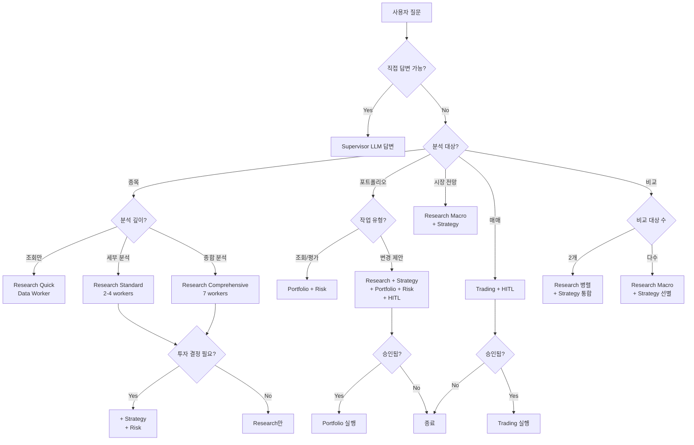

# Supervisor 라우팅 시나리오 매핑

**작성일**: 2025-01-02
**목적**: Supervisor의 컨텍스트 엔지니어링 기반 라우팅 최적화를 위한 상세 시나리오 매핑

---

## 📋 목차

1. [서브에이전트 구조](#서브에이전트-구조)
2. [분석 깊이 티어](#분석-깊이-티어)
3. [시나리오 매핑](#시나리오-매핑)
4. [라우팅 의사결정 트리](#라우팅-의사결정-트리)
5. [토큰 예산 분석](#토큰-예산-분석)

---

## 서브에이전트 구조

### Research Agent (7 Workers)
| Worker | 역할 | 주요 작업 |
|--------|------|-----------|
| **Data Worker** | 기초 데이터 수집 | 가격, 재무제표, 시장지표, 종목 코드 조회 |
| **Bull/Bear Analyst** | 시나리오 분석 | 상승/하락 시나리오, 리스크/기회 요인 |
| **Technical Analyst** | 기술적 분석 | 이평선, RSI/MACD, 지지/저항선, 차트 패턴 |
| **Trading Flow Analyst** | 수급 분석 | 외국인/기관/개인 매매 추세 |
| **Information Analyst** | 정보 수집 | 뉴스, 호재/악재, 리스크 이벤트 |
| **Macro Worker** | 거시경제 분석 | 금리, 환율, 경제지표 |
| **Insight Worker** | 통합 분석 | 심층 분석 결과 통합 및 인사이트 도출 |

### Strategy Agent (3 Specialists)
| Specialist | 역할 | 주요 작업 |
|-----------|------|-----------|
| **Buy Specialist** | 매수 평가 | 1-10점 매수 점수, 진입 타이밍, 가격 밸류에이션 |
| **Sell Specialist** | 매도 판단 | 매도 신호, 익절/손절 기준, 보유 지속 여부 |
| **Risk/Reward Calculator** | 손익 계산 | 손절가, 목표가, 리스크/리워드 비율 |

### Portfolio Agent (3 Nodes)
| Node | 역할 | 주요 작업 |
|------|------|-----------|
| **Market Condition** | 시장 상황 판단 | 시장 사이클 → 슬롯 조정 (공격/방어) |
| **Optimize Allocation** | 배분 최적화 | 샤프 비율, 위험 분산, 종목 가중치 |
| **Validate Constraints** | 제약 검증 | 최소/최대 보유 비율, 집중도 리스크 |

### Risk Agent (단일 노드)
- 포트폴리오 전체 리스크 측정 (VaR, 변동성, 상관계수)
- 집중도 리스크, 섹터 노출도 분석

### Trading Agent (단일 노드 + HITL)
- 매매 주문 생성 및 실행
- Automation Level 2+에서 승인 필요

---

## 분석 깊이 티어

| 티어 | Worker 수 | 처리 시간 | 비용 절감 | 사용 시나리오 |
|------|-----------|-----------|-----------|---------------|
| **Quick** | 1-3개 | 10-20초 | 75-87% | 단순 조회, 기초 정보 |
| **Standard** | 4-5개 | 30-45초 | 38-44% | 일반적인 분석 요청 |
| **Comprehensive** | 7-8개 | 60-90초 | 0% | 심층 분석, 투자 의사결정 |

---

## 시나리오 매핑

### Category 1: 간단한 질의 (Supervisor 직접 답변)

**라우팅**: 에이전트 호출 없음, LLM 직접 답변
**토큰 예산**: ~200-500 (질문) + ~300-800 (답변) = 500-1300 total

#### 1-1. 투자 용어 설명
**예시 질문**:
- "PER이 뭐야?"
- "샤프 비율 설명해줘"
- "RSI 지표는 어떻게 해석해?"

**처리**: Supervisor LLM 지식으로 즉시 답변
**근거**: 일반 지식, 에이전트 호출 불필요

#### 1-2. 시스템 사용법
**예시 질문**:
- "어떤 기능이 있어?"
- "포트폴리오 만들려면 어떻게 해?"
- "자동화 레벨은 뭐야?"

**처리**: Supervisor가 시스템 기능 안내
**근거**: 메타 정보, 에이전트 불필요

#### 1-3. 간단한 시장 상식
**예시 질문**:
- "증시는 몇 시에 열어?"
- "코스피와 코스닥 차이는?"
- "배당락일이 뭐야?"

**처리**: LLM 직접 답변
**근거**: 상식 수준, 실시간 데이터 불필요

---

### Category 2: 단순 종목 정보 조회 (Research Quick)

**라우팅**: `research_agent` (Quick)
**서브에이전트**: Data Worker (1개)
**토큰 예산**: ~1000-1500

#### 2-1. 종목 코드 조회
**예시 질문**:
- "삼성전자 종목 코드 알려줘"
- "NAVER 종목번호 뭐야?"

**서브에이전트**: Data Worker
**병렬 실행**: 없음 (단일 조회)

#### 2-2. 현재 주가 조회
**예시 질문**:
- "삼성전자 현재가 얼마야?"
- "SK하이닉스 주가 알려줘"

**서브에이전트**: Data Worker
**병렬 실행**: 없음

#### 2-3. 기본 재무 정보
**예시 질문**:
- "삼성전자 PER 얼마야?"
- "현대차 부채비율 알려줘"

**서브에이전트**: Data Worker
**병렬 실행**: 없음

#### 2-4. 거래량/시가총액 조회
**예시 질문**:
- "삼성전자 오늘 거래량은?"
- "카카오 시가총액 얼마야?"

**서브에이전트**: Data Worker
**병렬 실행**: 없음

---

### Category 3: 종목 세부 분석 (Research + Strategy Standard)

**라우팅**: `research_agent` + `strategy_agent` (일부 시나리오)
**분석 깊이**: Standard (4-5 workers)
**토큰 예산**: ~3000-5000

#### 3-1. 기술적 분석
**예시 질문**:
- "삼성전자 차트 분석해줘"
- "SK하이닉스 RSI 지표 어때?"
- "현대차 이동평균선 보여줘"

**서브에이전트**:
- Research: Data Worker, Technical Analyst (2개)
- Strategy: 없음

**병렬 실행**: Research 내부 2개 worker 병렬
**순차 의존성**: Data → Technical (가격 데이터 필요)

#### 3-2. 재무 분석
**예시 질문**:
- "삼성전자 재무제표 분석해줘"
- "LG전자 수익성 어때?"
- "네이버 재무 건전성 평가"

**서브에이전트**:
- Research: Data Worker (1개)
- Strategy: Buy Specialist (밸류에이션 평가만)

**병렬 실행**: 없음 (Research → Strategy 순차)
**근거**: 재무 데이터 수집 후 평가 필요

#### 3-3. 전망 분석
**예시 질문**:
- "삼성전자 향후 전망은?"
- "반도체 업황 어떻게 될까?"
- "현대차 주가 전망"

**서브에이전트**:
- Research: Bull/Bear Analyst, Macro Worker (2개)
- Strategy: 없음

**병렬 실행**: Research 내부 2개 worker 병렬
**근거**: 상승/하락 시나리오와 거시경제는 독립적

#### 3-4. 수급 분석
**예시 질문**:
- "삼성전자 외국인 수급 어때?"
- "SK하이닉스 기관 매매 동향"
- "카카오 개인 투자자 추세"

**서브에이전트**:
- Research: Trading Flow Analyst (1개)
- Strategy: 없음

**병렬 실행**: 없음

#### 3-5. 뉴스/이슈 분석
**예시 질문**:
- "삼성전자 최근 뉴스 정리해줘"
- "현대차 이슈 있어?"
- "네이버 호재/악재 뭐야?"

**서브에이전트**:
- Research: Information Analyst (1개)
- Strategy: 없음

**병렬 실행**: 없음

#### 3-6. 거품 여부 분석
**예시 질문**:
- "삼성전자 지금 고평가된 거 아냐?"
- "SK하이닉스 주가 거품이야?"
- "현재가가 적정해?"

**서브에이전트**:
- Research: Data Worker, Technical Analyst, Bull/Bear Analyst (3개)
- Risk: 리스크 평가

**병렬 실행**: Research 3개 worker 병렬 → Risk 순차
**근거**: 데이터 수집 후 리스크 평가

---

### Category 4: 종목 분석 + 투자 의사결정 (Comprehensive)

**라우팅**: `research_agent` + `strategy_agent` + `risk_agent`
**분석 깊이**: Comprehensive (7-8 workers)
**토큰 예산**: ~7000-10000

#### 4-1. 종합 분석
**예시 질문**:
- "삼성전자 분석해줘"
- "SK하이닉스 투자 어때?"
- "현대차 심층 분석"

**서브에이전트**:
- Research: 7개 worker 모두 (Comprehensive)
- Strategy: Buy Specialist, Risk/Reward Calculator
- Risk: 포트폴리오 영향 평가

**병렬 실행**: Research 7개 병렬 → Strategy 2개 병렬 → Risk 순차
**근거**: 모든 관점 종합, 투자 의사결정 지원

#### 4-2. 매수 타이밍 판단
**예시 질문**:
- "삼성전자 지금 사도 돼?"
- "SK하이닉스 매수 적기야?"
- "진입 타이밍 알려줘"

**서브에이전트**:
- Research: Data Worker, Technical Analyst, Bull/Bear Analyst, Trading Flow Analyst (4개)
- Strategy: Buy Specialist, Risk/Reward Calculator
- Risk: 단기 변동성

**병렬 실행**: Research 4개 병렬 → Strategy 2개 병렬 → Risk 순차

#### 4-3. 매도 판단
**예시 질문**:
- "삼성전자 팔아야 할까?"
- "SK하이닉스 보유 vs 매도?"
- "익절 타이밍인가?"

**서브에이전트**:
- Research: Data Worker, Technical Analyst, Bull/Bear Analyst, Information Analyst (4개)
- Strategy: Sell Specialist, Risk/Reward Calculator
- Risk: 보유 리스크

**병렬 실행**: Research 4개 병렬 → Strategy 2개 병렬 → Risk 순차

#### 4-4. 목표가/손절가 설정
**예시 질문**:
- "삼성전자 목표가 얼마로 잡을까?"
- "SK하이닉스 손절가는?"
- "적정 익절가 알려줘"

**서브에이전트**:
- Research: Data Worker, Technical Analyst, Bull/Bear Analyst (3개)
- Strategy: Risk/Reward Calculator
- Risk: 최대 손실 허용치

**병렬 실행**: Research 3개 병렬 → Strategy → Risk 순차

---

### Category 5: 종목 비교 (Research + Strategy)

**라우팅**: `research_agent` (복수 종목) + `strategy_agent`
**토큰 예산**: ~5000-8000 (종목 수에 비례)

#### 5-1. 2종목 비교
**예시 질문**:
- "삼성전자 vs SK하이닉스 비교해줘"
- "현대차와 기아 중 어디가 나아?"
- "네이버 vs 카카오 투자 매력도"

**서브에이전트**:
- Research: Data Worker, Technical Analyst, Bull/Bear Analyst (각 종목마다)
- Strategy: Buy Specialist (비교 평가)

**병렬 실행**: 각 종목 Research 병렬 → Strategy 통합 비교
**근거**: 독립적인 종목 분석 후 비교

#### 5-2. 섹터 내 비교
**예시 질문**:
- "반도체 종목 중 어디가 좋아?"
- "자동차주 추천해줘"
- "은행주 비교 분석"

**서브에이전트**:
- Research: Data Worker, Macro Worker (섹터 전체)
- Strategy: Buy Specialist (종목 선별)

**병렬 실행**: Research 2개 worker 병렬 → Strategy 순차

#### 5-3. 대체 종목 추천
**예시 질문**:
- "삼성전자 대신 투자할 만한 종목은?"
- "SK하이닉스 유사 종목 알려줘"
- "비슷한 업종 다른 종목 추천"

**서브에이전트**:
- Research: Data Worker, Macro Worker, Information Analyst (3개)
- Strategy: Buy Specialist (후보 평가)

**병렬 실행**: Research 3개 병렬 → Strategy 순차

---

### Category 6: 시장 상황/전망 (Research + Strategy)

**라우팅**: `research_agent` + `strategy_agent`
**토큰 예산**: ~4000-6000

#### 6-1. 시장 전체 전망
**예시 질문**:
- "코스피 전망은?"
- "증시 상황 어때?"
- "시장 분위기 알려줘"

**서브에이전트**:
- Research: Macro Worker, Information Analyst, Bull/Bear Analyst (3개)
- Strategy: Market Condition 판단 (간접 호출)

**병렬 실행**: Research 3개 병렬 → Strategy 순차

#### 6-2. 섹터 로테이션
**예시 질문**:
- "지금 어떤 섹터가 유망해?"
- "경기 사이클상 어디 투자해야 해?"
- "방어주 vs 공격주"

**서브에이전트**:
- Research: Macro Worker, Bull/Bear Analyst (2개)
- Strategy: 섹터 배분 조언

**병렬 실행**: Research 2개 병렬 → Strategy 순차

#### 6-3. 거시경제 영향
**예시 질문**:
- "금리 인상이 증시에 미치는 영향은?"
- "환율 변동 어떻게 봐야 해?"
- "경제지표 해석해줘"

**서브에이전트**:
- Research: Macro Worker, Bull/Bear Analyst (2개)
- Strategy: 없음

**병렬 실행**: Research 2개 병렬

---

### Category 7: 포트폴리오 조회/평가 (Portfolio + Risk)

**라우팅**: `portfolio_agent` + `risk_agent`
**토큰 예산**: ~3000-5000

#### 7-1. 포트폴리오 조회
**예시 질문**:
- "내 포트폴리오 보여줘"
- "보유 종목 알려줘"
- "현재 수익률은?"

**서브에이전트**:
- Portfolio: 기본 조회 (서브에이전트 없음)
- Risk: 없음

**병렬 실행**: 없음

#### 7-2. 포트폴리오 진단
**예시 질문**:
- "내 포트폴리오 평가해줘"
- "현재 구성 어때?"
- "문제점 있어?"

**서브에이전트**:
- Portfolio: Market Condition, Optimize Allocation (2개)
- Risk: 전체 리스크 측정

**병렬 실행**: Portfolio 2개 병렬 → Risk 순차

#### 7-3. 리스크 체크
**예시 질문**:
- "내 포트폴리오 리스크 얼마나 돼?"
- "변동성 큰 종목 있어?"
- "집중도 리스크 체크해줘"

**서브에이전트**:
- Portfolio: 없음
- Risk: VaR, 집중도, 섹터 노출도

**병렬 실행**: 없음 (Risk만 단독)

---

### Category 8: 포트폴리오 변경 제안 (3개 + HITL)

**라우팅**: `research_agent` + `strategy_agent` + `portfolio_agent` + `risk_agent`
**HITL**: Automation Level 2+에서 승인 필요
**토큰 예산**: ~8000-12000

#### 8-1. 포트폴리오 구성
**예시 질문**:
- "1000만원으로 포트폴리오 만들어줘"
- "안정적인 포트폴리오 구성해줘"
- "성장주 중심으로 구성"

**서브에이전트**:
- Research: Macro Worker, Information Analyst (시장 상황)
- Strategy: Buy Specialist (종목 선별)
- Portfolio: Market Condition, Optimize Allocation, Validate Constraints (3개)
- Risk: 전체 리스크 검증

**병렬 실행**: Research 병렬 → Strategy → Portfolio 3개 순차 → Risk
**HITL**: 최종 구성 승인

#### 8-2. 리밸런싱 제안
**예시 질문**:
- "포트폴리오 리밸런싱해줘"
- "비중 조정 필요해?"
- "재조정 제안해줘"

**서브에이전트**:
- Research: Macro Worker (시장 상황 변화)
- Strategy: Buy/Sell Specialist (종목별 평가)
- Portfolio: Market Condition, Optimize Allocation, Validate Constraints (3개)
- Risk: 리밸런싱 전후 비교

**병렬 실행**: Research → Strategy 병렬 → Portfolio 3개 순차 → Risk
**HITL**: 리밸런싱 승인

#### 8-3. 종목 추가/제거
**예시 질문**:
- "삼성전자 포트폴리오에 추가해줘"
- "SK하이닉스 빼줘"
- "현대차 20% 비중으로 넣어줘"

**서브에이전트**:
- Research: Data Worker, Bull/Bear Analyst (대상 종목)
- Strategy: Buy/Sell Specialist (추가/제거 타당성)
- Portfolio: Optimize Allocation, Validate Constraints (2개)
- Risk: 변경 후 리스크

**병렬 실행**: Research 병렬 → Strategy → Portfolio 2개 순차 → Risk
**HITL**: 변경 승인

#### 8-4. 비중 조정
**예시 질문**:
- "삼성전자 비중 줄여줘"
- "현금 비중 30%로 높여줘"
- "방어주 늘리고 싶어"

**서브에이전트**:
- Research: Macro Worker (시장 상황)
- Strategy: 없음
- Portfolio: Market Condition, Optimize Allocation, Validate Constraints (3개)
- Risk: 조정 후 리스크

**병렬 실행**: Research → Portfolio 3개 순차 → Risk
**HITL**: 비중 조정 승인

---

### Category 9: 매매 실행 (Trading + HITL)

**라우팅**: `trading_agent`
**HITL**: 필수 (모든 Automation Level)
**토큰 예산**: ~1500-2500

#### 9-1. 매수 주문
**예시 질문**:
- "삼성전자 10주 매수해줘"
- "SK하이닉스 100만원어치 사줘"
- "현대차 시장가로 매수"

**서브에이전트**:
- Trading: 주문 생성
- 선행 분석 권장: Research + Strategy (매수 타당성)

**병렬 실행**: 없음
**HITL**: 매수 주문 승인

#### 9-2. 매도 주문
**예시 질문**:
- "삼성전자 전량 매도"
- "SK하이닉스 절반 팔아줘"
- "현대차 손절해줘"

**서브에이전트**:
- Trading: 주문 생성
- 선행 분석 권장: Strategy Sell Specialist (매도 타당성)

**병렬 실행**: 없음
**HITL**: 매도 주문 승인

#### 9-3. 조건부 주문
**예시 질문**:
- "삼성전자 70000원 되면 매수해줘"
- "SK하이닉스 손절가 설정"
- "목표가 도달하면 매도"

**서브에이전트**:
- Trading: 조건부 주문 생성
- Strategy: Risk/Reward Calculator (가격 타당성)

**병렬 실행**: Strategy → Trading 순차
**HITL**: 조건부 주문 승인

---

### Category 10: 복합 명령 (순차 실행)

**라우팅**: 복수 에이전트 순차 실행
**토큰 예산**: 개별 작업 합계

#### 10-1. 분석 후 매수
**예시 질문**:
- "삼성전자 분석하고 괜찮으면 사줘"
- "SK하이닉스 평가 후 매수 여부 결정"
- "검토 후 포트폴리오 추가"

**서브에이전트 순서**:
1. Research (Comprehensive) + Strategy + Risk
2. HITL: 분석 결과 확인
3. Trading (매수 주문)
4. HITL: 주문 승인

**병렬 실행**: 단계별 순차
**근거**: 분석 결과에 따라 매수 여부 결정

#### 10-2. 비교 후 선택
**예시 질문**:
- "삼성전자 vs SK하이닉스 비교하고 나은 쪽 사줘"
- "반도체주 중 베스트 골라서 매수"
- "두 종목 분석 후 추천 종목 매수"

**서브에이전트 순서**:
1. Research (복수 종목) + Strategy (비교)
2. HITL: 선택 확인
3. Trading (매수 주문)
4. HITL: 주문 승인

**병렬 실행**: 1단계 종목별 병렬, 2-4단계 순차

#### 10-3. 리밸런싱 + 매매
**예시 질문**:
- "포트폴리오 리밸런싱하고 실행해줘"
- "재조정 후 바로 매매"
- "비중 조정 실행"

**서브에이전트 순서**:
1. Research + Strategy + Portfolio + Risk
2. HITL: 리밸런싱 계획 승인
3. Trading (복수 주문)
4. HITL: 각 주문 승인

**병렬 실행**: 1단계 병렬, 2-4단계 순차

---

### Category 11: 컨텍스트 의존 질문

**라우팅**: 이전 대화 참조 + 적절한 에이전트
**토큰 예산**: 시나리오 의존

#### 11-1. 이전 분석 참조
**예시 질문**:
- "아까 분석한 종목 사도 돼?"
- "방금 추천한 거 포트폴리오에 넣어줘"
- "이전 결과 다시 보여줘"

**처리**:
1. 대화 히스토리에서 컨텍스트 추출
2. 해당 시나리오로 라우팅

**병렬 실행**: 참조된 작업에 따름

#### 11-2. 추가 질문
**예시 질문**:
- "그럼 리스크는 어때?"
- "목표가는 얼마로?"
- "다른 종목은?"

**처리**:
1. 이전 에이전트 결과 참조
2. 추가 분석 에이전트 호출

**병렬 실행**: 일반적으로 순차 (기존 결과 기반)

#### 11-3. 수정 요청
**예시 질문**:
- "비중 더 높여줘"
- "다른 종목으로 바꿔줘"
- "조건 수정"

**처리**:
1. 이전 승인 요청 참조
2. 파라미터 수정 후 재생성

**병렬 실행**: 없음

---

### Category 12: 애매한/잘못된 요청

**라우팅**: Supervisor 직접 처리 또는 명확화 요청
**토큰 예산**: ~500-1500

#### 12-1. 모호한 요청
**예시 질문**:
- "좋은 종목 알려줘"
- "돈 벌고 싶어"
- "추천해줘"

**처리**:
1. Supervisor가 명확화 질문 생성
2. "어떤 섹터/가격대/투자 스타일을 원하시나요?"

**병렬 실행**: 없음

#### 12-2. 범위 벗어남
**예시 질문**:
- "미국 주식 추천해줘" (해외 주식)
- "비트코인 어때?" (암호화폐)
- "부동산 투자 조언" (주식 외)

**처리**: Supervisor가 지원 불가 안내
**병렬 실행**: 없음

#### 12-3. 불충분한 정보
**예시 질문**:
- "매수해줘" (종목 미지정)
- "분석해봐" (대상 불명)
- "비중 조정" (방향 미지정)

**처리**: Supervisor가 추가 정보 요청
**병렬 실행**: 없음

#### 12-4. 시스템 한계
**예시 질문**:
- "내일 주가 맞춰봐" (예측 불가)
- "100% 수익 보장해줘" (비현실적)
- "무조건 오를 종목" (불가능)

**처리**: Supervisor가 한계 설명 + 대안 제시
**병렬 실행**: 없음

---

## 라우팅 의사결정 트리

---

## 토큰 예산 분석

### 에이전트별 예상 토큰 소비

| 에이전트 | 모드 | Input | Output | Total | 비고 |
|---------|------|-------|--------|-------|------|
| **Research** | Quick | 500-800 | 500-700 | 1000-1500 | 1-3 workers |
| **Research** | Standard | 1000-1500 | 2000-3000 | 3000-4500 | 4-5 workers |
| **Research** | Comprehensive | 1500-2000 | 5000-7000 | 6500-9000 | 7 workers |
| **Strategy** | Buy | 800-1000 | 800-1200 | 1600-2200 | 매수 평가 |
| **Strategy** | Sell | 800-1000 | 600-1000 | 1400-2000 | 매도 판단 |
| **Strategy** | Risk/Reward | 500-700 | 400-600 | 900-1300 | 손익 계산 |
| **Portfolio** | 조회 | 300-500 | 500-800 | 800-1300 | 기본 조회 |
| **Portfolio** | 진단 | 1000-1500 | 1500-2500 | 2500-4000 | 최적화 포함 |
| **Portfolio** | 구성/리밸런싱 | 1500-2000 | 3000-5000 | 4500-7000 | 전체 프로세스 |
| **Risk** | 단일 | 800-1000 | 1000-1500 | 1800-2500 | VaR, 집중도 |
| **Trading** | 주문 | 400-600 | 300-500 | 700-1100 | 주문 생성만 |

### 시나리오별 총 토큰 예산

| Category | 최소 | 평균 | 최대 | 주요 에이전트 |
|----------|------|------|------|---------------|
| 1. 간단한 질의 | 500 | 900 | 1300 | Supervisor만 |
| 2. 단순 조회 | 1000 | 1250 | 1500 | Research Quick |
| 3. 세부 분석 | 3000 | 4000 | 5000 | Research Standard |
| 4. 종합 분석 | 7000 | 8500 | 10000 | Research + Strategy + Risk |
| 5. 비교 | 5000 | 6500 | 8000 | Research x2 + Strategy |
| 6. 시장 전망 | 4000 | 5000 | 6000 | Research + Strategy |
| 7. 포트폴리오 조회 | 3000 | 4000 | 5000 | Portfolio + Risk |
| 8. 포트폴리오 변경 | 8000 | 10000 | 12000 | 4개 에이전트 |
| 9. 매매 실행 | 1500 | 2000 | 2500 | Trading + HITL |
| 10. 복합 명령 | 10000 | 15000 | 20000 | 복수 에이전트 순차 |
| 11. 컨텍스트 질문 | 시나리오 의존 | - | - | 참조 + 추가 분석 |
| 12. 애매한 요청 | 500 | 1000 | 1500 | Supervisor 명확화 |

### 최적화 전략

1. **직접 답변 우선**: Category 1, 12 → 80-90% 토큰 절감
2. **Quick 모드 활용**: Category 2 → 75-87% 절감
3. **서브에이전트 선택적 활성화**: Category 3 → 38-44% 절감
4. **병렬 실행**: Category 4, 5 → 시간 단축 (토큰 동일)
5. **컨텍스트 재사용**: Category 11 → 중복 분석 방지

### 목표 토큰 예산

- **Supervisor 프롬프트**: ~2000 (현재 ~3000에서 30% 감축)
- **평균 대화당**: 4000-6000 (Standard 시나리오 기준)
- **최대 복합 명령**: 20000 이하 유지

---

## 부록: 예시 대화 흐름

### 예시 1: 종합 분석 + 매수 (Category 4 + 9)

**사용자**: "삼성전자 분석하고 괜찮으면 10주 사줘"

**Supervisor 라우팅**:
1. **Research** (Comprehensive): 7 workers 병렬
   - Data, Technical, Trading Flow, Information, Bull/Bear, Macro, Insight
2. **Strategy**: Buy Specialist, Risk/Reward Calculator 병렬
3. **Risk**: 포트폴리오 영향 평가
4. **HITL**: 분석 결과 확인 요청
5. (승인 시) **Trading**: 매수 주문 생성
6. **HITL**: 주문 승인 요청
7. (승인 시) 주문 실행

**토큰 예산**: ~12000-15000

---

### 예시 2: 포트폴리오 리밸런싱 (Category 8-2)

**사용자**: "내 포트폴리오 리밸런싱해줘"

**Supervisor 라우팅**:
1. **Research**: Macro Worker (시장 상황 변화)
2. **Strategy**: Buy/Sell Specialist (각 종목 재평가) 병렬
3. **Portfolio**:
   - Market Condition (시장 사이클)
   - Optimize Allocation (최적 비중 계산)
   - Validate Constraints (제약 검증)
4. **Risk**: 리밸런싱 전후 비교
5. **HITL**: 리밸런싱 계획 승인 요청

**토큰 예산**: ~10000-12000

---

### 예시 3: 간단한 조회 (Category 2-2)

**사용자**: "삼성전자 현재가 얼마야?"

**Supervisor 라우팅**:
1. **Research** (Quick): Data Worker만

**토큰 예산**: ~1000-1500

---

## 결론

이 문서는 45개 이상의 세부 시나리오를 서브에이전트 수준까지 매핑하여:

1. **토큰 효율성**: 불필요한 에이전트 호출 최소화
2. **응답 속도**: 병렬 실행 vs 순차 실행 명확화
3. **분석 품질**: 시나리오별 적절한 깊이 보장
4. **HITL 최적화**: 승인이 필요한 지점 명확화

Supervisor 프롬프트 재작성 시 이 문서의 핵심 시나리오 10-12개를 추출하여 컨텍스트 엔지니어링 원칙에 따라 구조화합니다.
